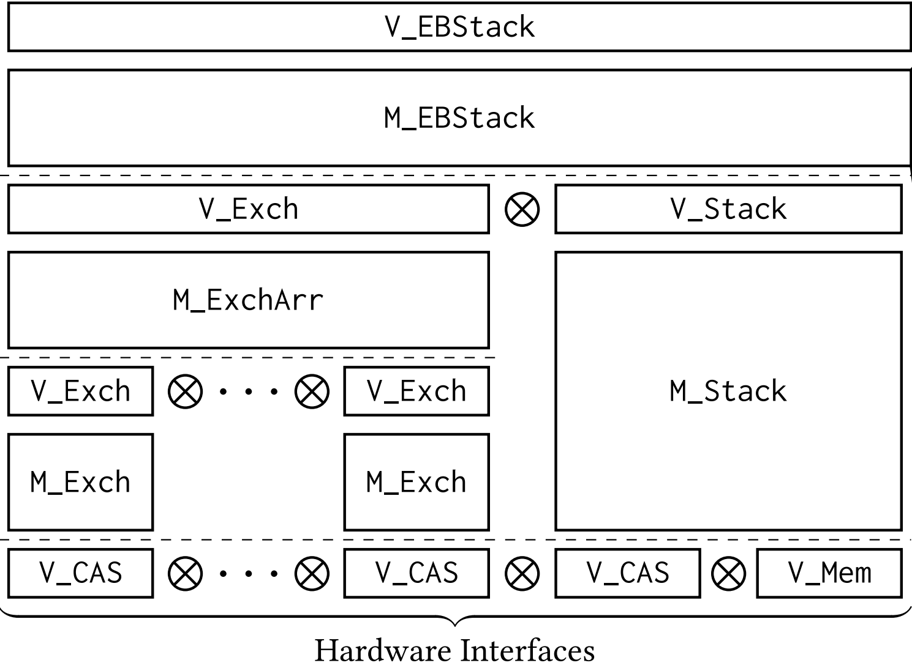

# LHL

## ECOOPS26 Note

Please see `Paper.v` for correspondance between the paper and this artifact.

## Overview

LHL is the first sound and complete program logic for _compositional linearizability_, which is a generalization of atomic linearizability, set linearizability, and interval linearizability. This makes it complete for concurrent objects. LHL uses a compositional model for concurrent computation which enables us to use the features of compositional linearizability to link verified components together into large systems with a high-level of abstraction for their subcomponents.

To summarize, LHL enables the following:
1. Verification of programs with arbitrary levels of complexity in their usage of concurrency -- i.e, anything from atomic-linearizable to interval-linearizable
2. Verification of concurrent programs in a _modular_ fashion - i.e no abstraction boundaries need to be broken for a module to be verified
3. Unrestricted _composition_ of verified programs and proofs

No existing program logic fulfils all of these points.

<center>

</center>

As a showcase, we verify the elimination-backoff stack implementation modularly by verifying all of its sub-components against their linearized specifications and then linking them together using compositional linearizability. Each component is verified against its abstract specification, after which programs and proofs are composed. This yields "for free" a proof of correctness of the entire combined system.

## Contents

### Examples

Examples of the program logic's usage.

- `Examples/Exchanger/*`: Contains the set-linearizable exchanger specification `ExchangerSpec.v` along with two implementations. `Exchanger.v` is a one-cell exchanger, `ElimArray.v` is an array of exchangers.
- `Examples/Stack/{AtomicStackSpec.v, EBStack.v}`: The atomic stack specification and its implementation as the elimination-backoff stack.
- `Examples/Stack/{WaitFreeStackSpec.v, WaitFreeStack.v}`: The set-linearizable wait-free stack specification and its implementation, used in the construction of the elimination-backoff stack.
- `Examples/WriteSnapshot/*`: The interval-linearizable write-snapshot and its specification
- `Examples/Lock/*`: The atomic lock specification and two implementations, a spinlock and a ticket lock
- `Examples/LockAround/*`: An object that takes another object and wraps it with calls to a lock, resulting in an atomic-linearizable object

### LHL

Implementation of LHL.

- `Core/Program.v`: Definition of programs.
- `Core/Specs.v`: Definition of specifications.
- `Core/Traces.v`: Definition of our operational semantics and vertical composition.
- `Core/Linearizability.v`: Definition of compositional linearizability.
- `Core/RefinesFacts.v`: Important theorems about refinement.
- `Core/LinFacts.v`: Proofs of observational refinement and locality, needed for compositionality
- `Core/Tensor.v`: Definition of horizontal composition
- `Core/Logic.v`: Definition of LHL
- `Core/LogicFacts.v`: Proofs of soundness and completeness for LHL
- `Core/ProgramRules.v`: Proofs of derived rules for control structures

## Setup

The following series of commands will build and check all files in the project, including `Examples`.
```
docker build -t lhl-artifact .
docker run -it lhl-artifact
./build.sh
```


## Usage

The program logic is defined in `Logic.v`. Import this along with `Program.v` and `ProgramRules.v` to get the typical control flow constructs along with their derived rules. Modules are of type `Impl` -- once you define a module, you may verify it with the toplevel program logic judgement `VerifyImpl`. After this, you may import `LogicFacts.v` and use `soundness` to derive a linearizability proof.

From here, you may verify modules and compose them together using the theorems in `LinFacts.v`. `obs_ref` gives you vertical composition, and `locality` gives you horizontal composition.

See `ExchangerSpec.v` and `Exchanger.v` for a good example of using the program logic.
